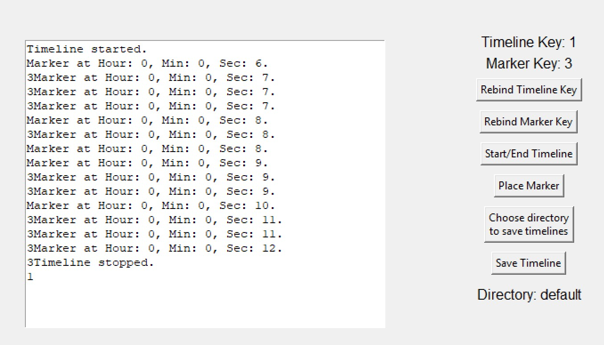

**Known Bugs**
========

### Bug 1: Ability to Edit the Timeline Textbox 1/8/25

- Steps to reproduce:

    - Keep the app in focus.

    - Click any hotkey rebinding button (e.g: `Rebind Timeline Key`)

    - Enter focus on the timeline text box on the left side of the app.

    - Rebind to any key or key combination that includes a key representing a character (e.g: `A` or `CTR + A`).

    - Use that bind in its respected manner with the app in focus.

- Notes:

    - Whenever the app is in focus, this problem can occur. When relaunching the the app, the bug does not 
    trigger unless the user focuses on the timeline textbox again.

- Cause:

    - Unknown. It is suspected that the `tk.Text` config option `state="disabled"` for `marker_display` is being bypassed.