**Clip Tracker**
========

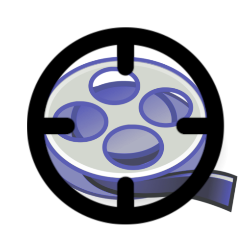

- Tired of searching through vods to make clips? 
- Dissatisfied with the auto-clip option that Twitch.tv (or any streaming/recording method) gives you?
- Do you want/need a light and straightforward application to mark moments onto a timeline?

## [Download Windows](https://github.com/Socram-Occots/ClipTracker/raw/refs/heads/main/output-windows/cliptracker.exe) -------------------- [Download Linux](https://github.com/Socram-Occots/ClipTracker/raw/refs/heads/main/output-linux/cliptracker)

### **WARNING** Your Anti-Virus will cry and cry about downloading and running Clip Tracker. 

- I am a solo developer and a novice. Fixing something like this is out of my scope for now.

- If you really don't trust downloading the application, feel free to check out the source files and compile them yourself.

- Any help on the matter would be wonderful. Thank you.

## Source Files and Bundling Setup

Instead of a onefile, you can directly use the source files instead:

### Python Dependencies:

- Required:

    ```
    Python 3 (Version 3.12.8 recomended)
    Keyboard Version 0.13.5

    ```

- Optional:

    ```
    Pyinstaller (Version 6.11.1 recomended)
    ```

### [Download the app folder from this github repo](https://download-directory.github.io/?url=https://github.com/Socram-Occots/ClipTracker/tree/f05a048d56f1283eefae05b86a7e77277dc80f82/app)
- You may need to unzip the folder from this download link.

### Run `main.py`

### Bundling with Pyinstaller (No onefile):

Cloning this repository is recomended.

From the directory `CLIPTRACKER` inside this respository, run this command.

```
pyinstaller --windowed --icon icon\cliptrackericon.ico --version-file output-windows\version-info-windows.txt --name cliptracker --distpath output-windows/ app/main.py
```

### Also, [the Clip Tracker bundle (Windows) can be downloaded directly](https://download-directory.github.io/?url=https://github.com/Socram-Occots/ClipTracker/tree/f05a048d56f1283eefae05b86a7e77277dc80f82/app)

## Features

**With Clip Tracker**, you can **start a timeline** when your stream (or any recorded event) begins,
 **mark certain moments** on it, end it, and **save it!**

**Save countess hours** of searching by referencing the timestamps **right at your fingertips!**

- **Limitless Timeline Marking**

    - Make, Mark, and Save as many timelines as you wish.

- **Customizable Hotkeys**

    - Record keyboard keybinds that work on the app even when it's out of focus or minimized.

    - Ability to record complex keybinds.

        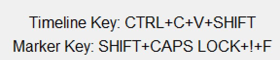

    - Designed to accept hotkey combinations ONLY in order.
    
        - Meaning, something such as `CTR+A` and `A+CTR` are two different hotkeys!

- **Settings**

    - Settings such as hotkeys and save directories are saved every time you change them.

    - There is no need to redo your settings the next time you open the app.

    - Settings are saved at the application's directory with the name `cliptrackersettings.json`.

        - *WARNING*: Directly editing your application's settings file comes with the risk of crashing/breaking it.

## Platforms

- Windows

- Linux 

    - *WARNING*, it needs Sudo permissions. This is due to the [Python keyboard library](https://pypi.org/project/keyboard/).
    You be able to use something like `sudo setcap cap_dac_read_search+ep ./cliptracker` instead. However, this is untested.

## Step-by-Step Guides 

### Creating a Complete Timeline Timeline and Marking:

- Start a timeline by using the `Start/End Timeline` button. 

    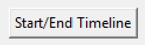

- It will begin a timeline.

    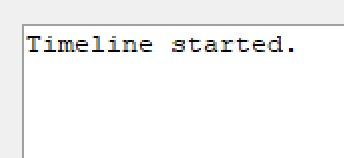

- When you wish to mark a point in the timeline: use the `Place Marker` button.

    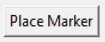

- It will enter a timestamp representing the marker.

    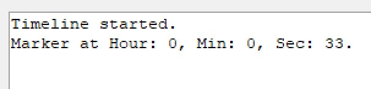

- Enter any many markers as you want, after the event ends use the `Start/End Timeline` button again to end the timeline.

    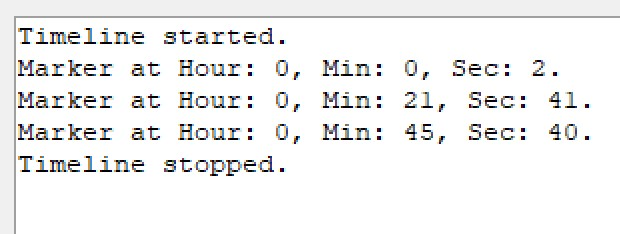

- If you wish, save the finished timeline with the `Save Timeline` button.

    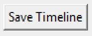

- By default, the text files are saved in the same location as the application file (e.g: `.exe`, ): `./CLIPTRACKER/app/`.

    The text file is named with the pattern `timeline{number}_{today's date: %yyyy-%mm-%dd}.txt`

    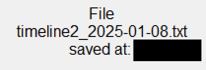

- A timeline text file will contain nothing but the marker timestamps.

    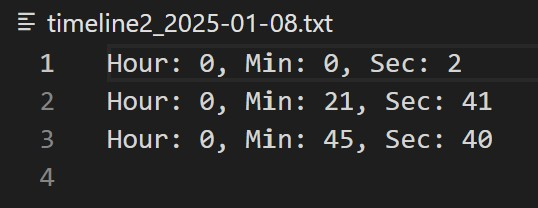

- To repeat this whole process again, simply using the `Start/End Timeline` button and start all over.

### Utilizing Hotkeys

- You are able to bind a key combination to cetain buttons such as `Start/End Timeline`.

- As an example, to rebind `Start/End Timeline`, you must use the `Rebind Timeline Key`.

    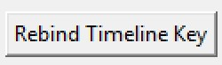

- Press a combination of keys on your keyboard, and release the combination to set it.

    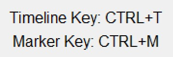

- You are now able to use that hotkey to activate `Start/End Timeline`.

- To rebind the key, repeat the process by activating the `Rebind Timeline Key` again.

- To clear the timeline key, use the `Clear Timeline Key` button. The hotkey will be deleted.

    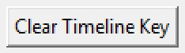

- The rebind feature is also available for:

    - `Place Marker`

### Choose Where to Save the Timeline Text Files

- You can customize where the timeline text files are saved by using the `Choose directory to save timelines` button.

    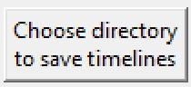

- Use the `Save Timeine` button to save your timeline text files will be at that location.

    

- Note: Timelines will still be saved if you choose not to customize the save directory.

    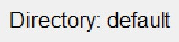

- The default directory is located where the Clip Tracker app is: `./CLIPTRACKER/app/`.

## Current Limitations

- Clip Tracker does not directly manage, influence, or connect with any recording/streaming application or website.

- Clip Tracker can only detect keys that are considered keyboard keys.

    - If a device is using a macro that executes keyboard hotkeys, that device should work.

- Clip Tracker only provides hotkeys for `Start/End Timeline` and `Place Marker`.

- Clip Tracker cannot import timeline text files to add markers.

- I, the creator of Clip Tracker, am unsuccessful in testing Clip Tracker in a Linux VM Docker environment. When running a Linux VM, windows (My host OS) fails to provide the root access to keyboard and mouse activity. This means (as of now) ClipTracker is not well-tested on Linux. Help on this part would be greatly appreciated.

## Feedback
[Feedback is welcome (Google Forms link)](https://forms.gle/VAUPoc1Qhi4d2XZc6)

## Languages
- Clip Tracker is available in:
    - English

## Known Bugs
[Known Bugs](KnownBugs.md)


## Licence:
[MIT License](LICENCE.txt)
